<picture>
  <source media="(prefers-color-scheme: dark)" srcset="assets/header-dark.svg" />
  
</picture>

  <a href="https://kriterio.dev">kriterio.dev</a>
  &nbsp;·&nbsp;
  <a href="https://www.linkedin.com/in/wilson-martinez-50097a220/">LinkedIn</a>
  &nbsp;·&nbsp;
  <a href="mailto:wm911m@gmail.com">wm911m@gmail.com</a>

 

I'm a full-stack developer in Loja, Ecuador. Since 2023 I've built web, mobile and machine learning systems for companies and freelance clients.

Most of my work sits on the backend: APIs in FastAPI, NestJS and Django, data on PostgreSQL and TimescaleDB, and ML services that serve live predictions. On the front I ship React and Next.js apps, and Flutter apps on Supabase, often inside Turborepo and pnpm monorepos.

Right now I'm building **[Kriterio](https://kriterio.dev)**, a site that compares developer tools side by side. Every article is checked against official sources and written from real project work.

## Selected work

| Project | What it is | Built with |
| :-- | :-- | :-- |
| **[Kriterio](https://github.com/rslcia11/monetizacion-web)** | Developer tool comparisons. 20 verified articles, social images generated at build time, full-text search. Scores 100 on Lighthouse mobile. | Astro, TypeScript, Cloudflare |
| **[IntelliCar](https://github.com/rslcia11/IntelliCar)** | Data mining for Ecuador's used-car market. Predicts fair prices, flags suspicious listings and adds semantic search. | Python, XGBoost, Streamlit |
| **[Workstation occupancy](https://github.com/rslcia11/controlForo)** | Real-time computer vision for labs and offices. YOLOv8 detects people, monitors and laptops from a webcam, and a proximity rule tells which workstations are free. Team project at UIDE. | Python, YOLOv8, OpenCV, Streamlit |
| **[Tarot avatar for TikTok LIVE](https://github.com/rslcia11/GeneradorAutomaticoLivesTiktok)** | An animated character that answers comments, gifts and follows in a live stream, out loud. | Node.js, Gemini, Edge TTS, PixiJS |
| **[Tactical Store](https://github.com/rslcia11/sukaTactical)** | Full-stack e-commerce for tactical gear in Ecuador, with a separate storefront and API. | Next.js, NestJS, Prisma, PostgreSQL |
| **[Free Scanner](https://github.com/rslcia11/freeScanerPuertosYServicios)** | Security scanner for Kali Linux. Finds open ports and service versions, looks up known CVEs in the NVD, audits web servers and writes JSON and HTML reports. Team project at UIDE. | Python, Nmap, Nikto, NVD API |
| **[EcoAlerta](https://github.com/rslcia11/ecoAlerta)** | Citizen reports of urban problems with photos and geolocation, and a panel for the city to follow each case. | Next.js, React, Tailwind CSS |
| **[Musa Rosa](https://github.com/rslcia11/musaRosa)** | Website for a client business, exported as a static site. | Next.js, Firebase Hosting |

## Stack

| | |
| :-- | :-- |
| **Backend** | FastAPI · Django · NestJS · Node.js · Express · SQLAlchemy · Prisma |
| **Frontend** | React · Next.js · TypeScript · TanStack Query · Vite · Tailwind CSS · shadcn/ui · Astro |
| **Mobile** | Flutter · Dart · Riverpod |
| **Data and ML** | PostgreSQL · TimescaleDB · Redis · Supabase · Firebase · Polars · LightGBM · scikit-learn · YOLOv8 · OpenCV |
| **Delivery** | Docker · Turborepo · pnpm · Prometheus · Grafana |
| **Security** | JWT with rotation · Argon2id · Row Level Security · OWASP Top 10 · Nmap · Nikto |
| **Testing** | pytest · testcontainers · Vitest · React Testing Library |

## How I work

**Business rules don't depend on the framework.** The code that matters should survive a change of database or web library.

**Tests run against real services.** pytest with testcontainers spins up a real Postgres, because mocks don't catch migration bugs.

**Security from the first commit.** JWT with rotation, Argon2id for passwords, and Row Level Security turned on before the first query.

 

Open to collaborations and freelance work on backends, data pipelines and full-stack products.

